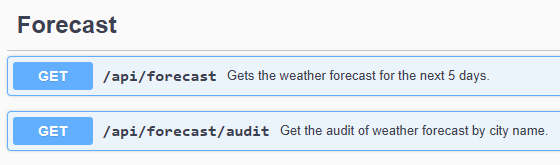
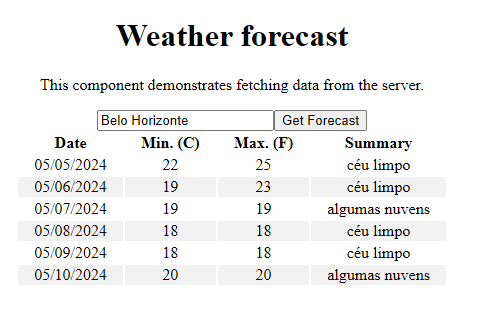
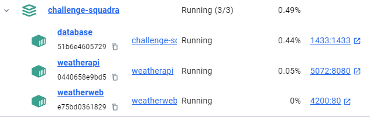
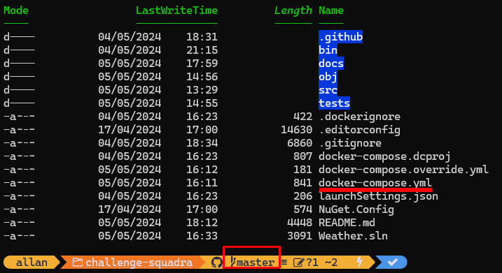

# Desafio Squadra

## Dados

- **Autor**: Allan Barros Pedroni
- **Email**: <allan.barros@gmail.com>
- **Linkedin**: <https://www.linkedin.com/in/allanpedroni/?locale=pt_BR>
- **Githubs**: https://github.com/allanpedroni e https://github.com/abpedroni

## Índice

- [Descrição](#descrição)
- [Requisitos](#requisitos)
- [Tecnologias](#tecnologias)
- [Executar o projeto local](#executar-o-projeto-local)
- [Executar os testes](#executar-os-testes)
- [O que pode ser evoluido](#o-que-pode-ser-evoluido)
- [Anexos](#anexos)

## Descrição

Este projeto é um desafio para a empresa Squadra, consiste em dois componentes, um backend (C#) e um frontend (angular).

O backend, escrito usando C#, é uma API REST que expõe dois endpoints:



Como requisito, foi solicitado a utilização da API do [OpenWeatherMap](https://openweathermap.org/forecast5) para obter os dados da previsão do tempo.

Toda requisição de obtenção da previsão do tempo será auditada, onde caso aconteça qualquer erro será gravado no banco qual motivo da falha.

O frontend é uma aplicação web que expõe apenas uma página que permite ao usuário pesquisar a previsão do tempo informando o nome de uma cidade. Serão exibidos os dados da previsão do tempo para os próximos 5 dias, contando com o dia atual.



A execução do projeto é feita através do docker-compose, onde são criados três containeres, backend, frontend e o banco de dados sqlserver.



## Requisitos Técnicos

- [x] Linguagem de programação C#- .NET e Angular.
- [x] Virtualização de container utilizando Docker.
- [x] Elaborar os endpoints utilizando padrão REST.
- [x] Poderá utilizar seu banco de dados a seu gosto, mas dê preferência para bancos relacionais, como SQL Server, Oracle.
- [x] Utilizar quaisquer bibliotecas e frameworks a seu gosto (Entity Framework, XUnit etc.), porém a chamada da API deve ser feita diretamente.
- [x] Elaborar um README com, no mínimo, as instruções referentes a subir o ambiente da sua aplicação;
- [x] Envie para o repositório quaisquer artefatos que tenha utilizado para implementar essa aplicação (collections do postman, testes unitários etc.);

## Tecnologias

- Visual studio Version 17.9.6
- Visual studio Code 1.89.0
- [.NET 8 SDK](https://dotnet.microsoft.com/pt-br/download/dotnet/8.0)
- [Entity Framework Core 8](https://docs.microsoft.com/en-us/ef/core/)
- [Angular 17.3.6](https://angular.io/)
- [NodeJS v20.12.2](https://angular.io/)
- [Mapster](https://github.com/MapsterMapper/Mapster)
- [XUnit](https://nunit.org/), [FluentAssertions](https://fluentassertions.com/), [Moq](https://github.com/moq)
- Swagger
- Serilog
- [Docker](https://www.docker.com/), Docker Compose

## Executar o projeto local

1. Clone o projeto para sua máquina local:

```bash
git clone https://github.com/allanpedroni/challenge-squadra.git
```

2. Acesse o diretório raiz onde o arquivo `docker-compose.yml` está localizado



3. Por fim, execute o comando `docker-compose up` (na raiz do repositório) para iniciar os dois projetos e um container do SQL Server. Assim que os containers forem iniciados:

- O aplicativo `Frontend Angular` escuta em:
  - Porta 4200 no IP do cartão de rede do Docker Host (PC)
  - Porta 80 no IP interno do contêiner
- O aplicativo `Backend API` escuta em:  
  - Porta 5072 no IP do cartão de rede do Docker Host (PC)
  - Porta 8080 no IP interno do contêiner
- O serviço `sqlserver` de dados:
  - Porta 1433 no IP do cartão de rede do Docker Host (PC)
  - Porta 1433 no IP interno do contêiner

4. Aguarde a execução do comando `docker-compose up` para finalizar a execução dos containers. Lembre-se que a primeira execução pode demorar um pouco mais, pois o docker irá baixar as imagens necessárias, além disso, o banco de dados precisa ser criado e populado via migration (automático).

>**Observação** Você será capaz de acessar as aplicações com os links abaixo.
>
> - [Weather.Web - Angular Web App](http://localhost:4200/)
> - [Weather.API - Documentação Swagger](http://localhost:5072/swagger/index.html)

## Executar os testes

1. Para o projeto backend, execute todos testes unitários do projeto com o comando abaixo, na pasta diretório raiz:

```bash
dotnet test
```

2. Para o projeto frontend, execute todos testes unitários do projeto com o comando abaixo, na pasta `src/Weather.Web`:

```bash
ng test
```

## O que pode ser evoluido

- Implementação de testes de integração para o frontend e backend.
- Inclusão e exposição de métricas de consumação da API externa, visto que está atrelado a um custo (exceto na versão free).
- Implementação de um cache para as requisições da API externa, visto que a mesma possui um limite de requisições por minuto.
- Devido a baixa complexidade do projeto, o backend foi criado com apenas um projeto, porém, em um cenário real, seria interessante a separação das responsabilidade de forma mais granular, como por exemplo, um projeto para a camada de domínio, outro para a camada de aplicação e outro para a camada de infraestrutura, ou seja, uma arquitetura mais limpa e escalável, alinhada ao DDD e um arquitetura hexagonal ou clean.
- Implementação de um pipeline de CI/CD para automatizar o deploy da aplicação.
- Implementação dos testes automatizados de integração rodando sobe novas versões disponibilizadas em ambientes de homologação e produção.
- Implementação de um design mais responsivo para o frontend.

## Anexos

- Relatório testes frontend - [link](tests/Weather.API.Services.Tests/Coveragereport/index.html).
- Relatório testes backend - [link](src/Weather.Web/coverage/index.html)
- Postman Collection - [link](src/Weather.API/Weather%20API.postman_collection.json)
